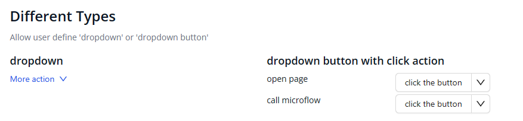
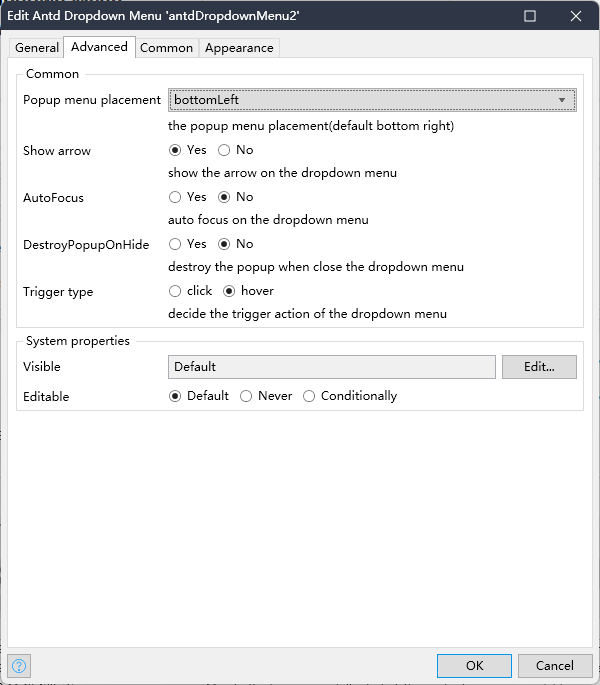

[English](https://github.com/wiwengweng/mendix-antd-dropdown-menu/blob/main/README.md)
## 介绍

基于Ant Design实现的 Mendix Widget小组件。组件实现了 Ant Design(antd) 中的 [`dropdown`](https://ant.design/components/dropdown-cn) 的绝大部分接口。你可以去[这里](https://ant.design/components/dropdown-cn)查看原始的 antd 组件的各种特性。

## 功能特性

1. 支持两种下拉样式的选择，包括：`dropdown`和`dropdown button`。
2. 支持静态定义或数据源datasource动态加载菜单。
3. 支持自定义每个菜单项的样式和状态。
4. 支持antd其他样式配置

## 快速安装和使用

1. 将该组件添加到 Mendix Project 中.
    1. 从[这里](https://github.com/wiwengweng/mendix-antd-dropdown-menu/releases/download/antdropdownmenu-v1.0.0/mendix.AntDropdownMenu.mpk)下载 mpk 文件.
    3. 把 mpk 文件复制到你的 Mendix Project 目录 `{YourMendixProjectFolder}/widgets/`.
    4. 用 Mendix Studio Pro 打开你的 Mendix Project，然后点击菜单 `Menu > App > Synchronize App Directory`.
2. 使用 `Antd Dropdown Menu`。
    1. 选择任意页面，并从 Mendix Studio Pro 的右侧 Toolbox 中搜索 `Antd Dropdown Menu`。
    2. 向页面添加一个`Antd Dropdown Menu`组件。
    3. 为该组件设置属性。双击该组件，做如下设置：
        1. 填写组件显示的名称;
        2. `Render type`选择`Static`;
        3. 在`Menu items`中增加菜单以及点击菜单触发的动作;

## Demo 项目

1. 你可以在[这里](https://demo-antdwidgets100.apps.ap-2a.mendixcloud.com/)访问在线 demo。  
2. 也可以从[这里](https://github.com/zjh1943/mendx-antd-widgets-show)下载 demo project，在自己的 Mendix Studio Pro 上启动运行。  

## 详细配置说明

### General

General页面中包含绝大部分的常用配置选项

* Memu name - 下拉菜单按钮显示的名称

* Render type - 支持简单下拉，或下拉按钮两种方式，下拉按钮可以支持左侧按钮点击事件配置

* Menu type - 支持静态配置若干菜单项，或者通过选择Dynamic使用data source动态渲染菜单
* Menu items - 静态菜单的菜单项配置，允许用户自行添加任意项
* popup menu placement - 弹出菜单的位置，分为左上、上、右上、左下、下和右下六种相对位置

Dropdown button properties
选择button模式下，可以额外配置如下几个属性

* Use danger style - 按钮显示危险样式，呈红色
* Button size - 可以使用 `大` `中` `小`三种按钮大小样式
* Button type - 可以定义 `primary` `ghost` `dashed` `link` `text` `default`六种样式
* Button click - 定义组件左侧按钮点击的事件

### Advanced

定义组件非必要的交互特性，采用默认选项也不影响组件的正常使用.

Common
* Popup menu placement - 弹出菜单的位置
* Show arrow - 是否显示弹出窗口上的小箭头
* AutoFocus - 打开后自动聚焦下拉框
* DestroyPopupOnHide - 关闭后是否销毁 Dropdown
* Trigger type - 触发下拉的行为, 移动端不支持 hover

System properties
包含两项系统通用配置，配置项可以根据外围的datasource进行可见性和可编辑性进行识别，分别是
* Visiable
* Editable

## 与 `antd` Dropdown 的功能对比

这里列举了 `antd` 中 `dropdown` 的所有参数，并说明了该组件是否支持该属性，以及不支持的原因。如果想查看`antd`中原属性的含义，请[移步这里](https://ant.design/components/dropdown-cn)。

## Issues, suggestions and feature requests
[Github Issue](https://github.com/wiwengweng/mendix-antd-dropdown-menu/issues)

同时欢迎小伙伴们进入中国技术论坛，了解和获取更多Mendix widget开发的思想碰撞 [传送门](https://marketplace.siemens.com.cn/low-code-community)

## 本地开发和贡献

1. 克隆项目到本地，并安装依赖:`npm install`. 如果 npm 版本是v7.x.x, （用户可使用`npm -v`检查版本）, 使用一下命令安装依赖:`npm install--legacy-peer-deps`.
2. 在命令行运行npm start开始编译打包组件:
    * 项目开始编译...
    * 等待编译完成，组件会在dist 目录下自动生成；
    * 开发者可以自行修改package.json中的配置项，指定Mendix的测试项目地址，编译完成后后组件会自动同步到deployment 和 widgets目录中。