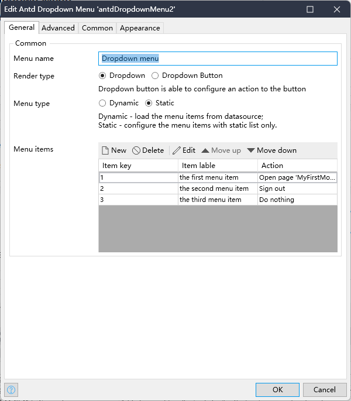
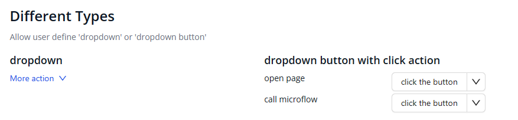
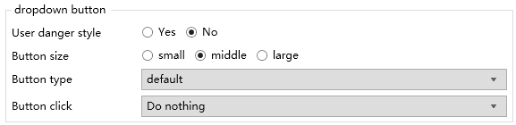
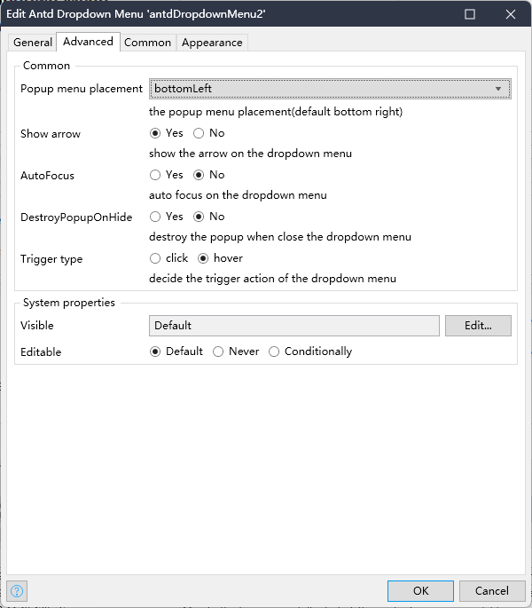
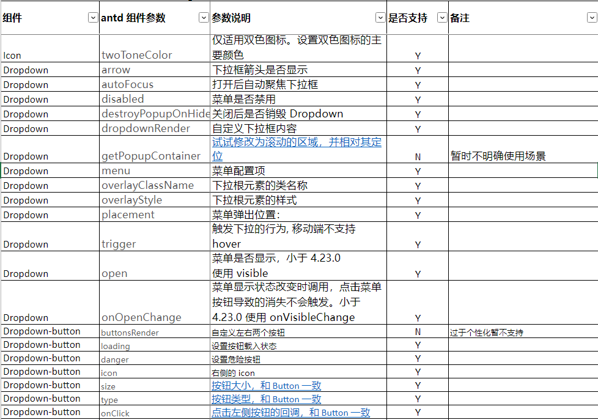

[中文版](https://github.com/wiwengweng/mendix-antd-dropdown-menu/blob/main/README-CN.md)
## Introduction

A Mendix Widget widget implemented based on Ant Design. The widget implements most of the interfaces of [`dropdown`](https://ant.design/components/dropdown) in Ant Design (antd). You can go [here](https://ant.design/components/dropdown) to see various features of the original antd component.
View features of this project on [online demo](https://demo-antdwidgets100.apps.ap-2a.mendixcloud.com/).

## Features

1. Support two dropdown styles, including: `dropdown` and `dropdown button`.
2. Support static definition or dynamic dropdown with datasource.
3. Customize the style and state of each menu item.
4. Support other Ant Design API configuration

## Quick start

1. Add the widget to Mendix Project.
    1. Download the latest mpk file from [here](https://github.com/wiwengweng/mendix-antd-dropdown-menu/releases).
    3. Copy the mpk file to your Mendix Project directory `{YourMendixProjectFolder}/widgets/`.
    4. Open your Mendix Project with Mendix Studio Pro, then click the menu `Menu > App > Synchronize App Directory`.
2. Use `Antd Dropdown`.
    1. Select any page and search `Antd Dropdown Menu` from the Toolbox in Mendix Studio Pro.
    2. Add an `Antd Dropdown Menu` widget to the page.
    3. Set properties for the widget. Double-click the widget and follow the settings:
        1. Fill in the `Menu Name`;
        2. `Render type` -> `Static`;
        3. Add menu items and trigger actions in `Menu items`;

## Demo project

1. You can access the online demo from [here](https://demo-antdwidgets100.apps.ap-2a.mendixcloud.com/) to show the features of this widget.   
2. You can also download the demo project from [here](https://github.com/zjh1943/mendx-antd-widgets-show) to run it on your own PC.

## Detailed configuration instructions

### General

The General tab contains most of the common configuration options

* Memu name - The name displayed by the dropdown menu button

* Render type - Support simple `dropdown`, or `dropdown button`, the dropdown button can support left-side button click event

* Menu type - `Static` supports static configuration with several menu items, or dynamically renders the menu using data source by selecting `Dynamic`
* Menu items - the menu item configuration of the static menu, allowing users to add any items by themselves
* popup menu placement - the position of the popup menu, divided into six relative positions: upper left, upper, upper right, lower left, lower and lower right

Dropdown button properties

In the button mode, you can also configure the following properties

* Use danger style - button shows danger style
* Button size - You can use `large` `medium` `small` button size styles
* Button type - you can define six styles within `primary` `ghost` `dashed` `link` `text` `default`
* Button click - defines the event when the button on the left-side of the widget is clicked

### Advanced

Define the non-essential interactive features of the widget, and the default options will work fine.

Common
* Popup menu placement - the placement of the popup menu
* Show arrow - Whether to show the small arrow on the popup window
* AutoFocus - Automatically focus the dropdown box after opening
* DestroyPopupOnHide - Whether to destroy the Dropdown after closing
* Trigger type - Trigger of the dropdown behavior (hover/click), the mobile terminal does not support hover

System properties
Two general configurations of the system properties. The configuration items can be identified according to the visibility and editability of the upper level datasource:
* Visiable
* Editable

## Functional comparison with `antd` Dropdown

This lists all the parameters of `dropdown` in `antd`, and explains whether the widget supports this APIs, and why without support(eventually developers can DIY). If you want to learn more of the original APIs in `antd`, please [check this out](https://ant.design/components/dropdown).

## Issues, suggestions and feature requests
[Github Issue](https://github.com/wiwengweng/mendix-antd-dropdown-menu/issues)

At the same time, your are welcome to get into the China Technology Forum to get more in Mendix widget development. [check this out](https://marketplace.siemens.com.cn/low-code-community)

## Local development and contributions

1. Clone the project locally and install dependencies with `npm install`. If the npm version is v7.x.x, (users can use `npm -v` to check the version), use the following command to install dependencies: `npm install --legacy- peer-deps`.
2. Run npm start in the command line to start bundle the widget:
    * Project started bundling...
    * Wait for the dinner, and the widget will be automatically generated in the dist directory;
    * Developers can modify the package.json, and specify the test project of Mendix. When your dinner is ready, the widget will be automatically synchronized to the `deployment` and `widgets` directories.